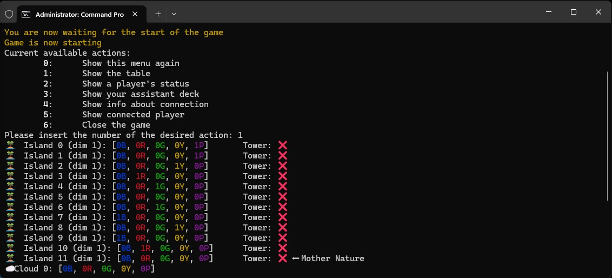

# ERIANTYS

This is the repository of main project for "_Progetto di Ingegneria del Software 2022_".

Game rules are available on the [creator's website](https://www.craniocreations.it/wp-content/uploads/2021/11/Eriantys_ITA_bassa.pdf)

Tests line coverage: client 4%, controller 17%, message 54%, model 82%, network 0%

Group components:

- 10697104 Baggetto Matteo ([@Matteo-Baggetto](https://github.com/Matteo-Baggetto)) [✉ Contact me](mailto:matteo.baggetto@mail.polimi.it)
- 10675392 Brambilla Matteo ([@bramba2000](https://github.com/bramba2000)) [✉ Contact me](mailto:matteo15.brambilla@mail.polimi.it)
- 10723902 Cerutti Paolo ([@PolCeru](https://github.com/PolCeru)) [✉ Contact me](mailto:paolo2.cerutti@mail.polimi.it)

## Starting game

1) In order to launch the **server** you have to go with terminal in its jar folder and
   write: `java -jar nameJar.jar --port port`
    - `--port` is an optional field.

2) In order to launch the **client** you have two options:
    - Repeat the same procedure and write `java -jar jarName.jar --graphics gui --address address --port port`
    - Double-click on the file for playing with graphics.
        - `--address` and `--port` are optional fields.
        - You can write `cli` instead of `gui`.

## Functionalities

| Functionality                         | State |
|:--------------------------------------|:-----:|
| Basic rules                           |  🟢   |
| Complete rules                        |  🟢   |
| Socket                                |  🟢   |
| GUI                                   |  🟢   |
| CLI                                   |  🟢   |
| Advanced characters                   |  🟢   |
| Resilience to disconnections          |  🟢   |
| Multiple games                        |  🟢   |

## Libraries and Plugins

| Libraries/Plugin | Description                                                   |
|------------------|---------------------------------------------------------------|
| **Maven**        | Compilation automation tool used primarily for Java projects. |
| **JavaFx**       | Graphic library for making user interfaces.                   |
| **JUnit**        | Unit Testing Framework.                                       |
| **Mockito**      | Mocking framework for unit tests.                             |
| **Log4j2**       | Logging framework.                                            |
| **Jansi**        | ANSI CLI utility library for console output.                  |

## Screenshots

Here are some highlights from the application:

**CLI Login**  

**CLI Board**  

**GUI Login**  

**GUI Board**  

**Server Log**  

**Documentation and UML diagrams**

- Full JavaDocs can be found in `deliverables/JavaDocs/` (open `index.html` for the main page).
- UML diagrams and sources are available in `deliverables/UMLs/`.
